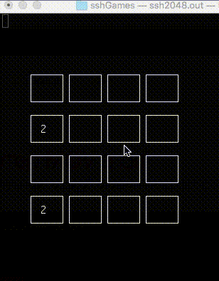

# ssh2048
 Simple game for terminal
 Just for fun and learning ncurses
 #### View
 
 #### Compilation
```
g++ ssh2048.c -lncurses -o ssh2048
```
#### Launch
```
./ssh2048
```
#### Controls
Arrows for moving 
CTRL+C for exit
